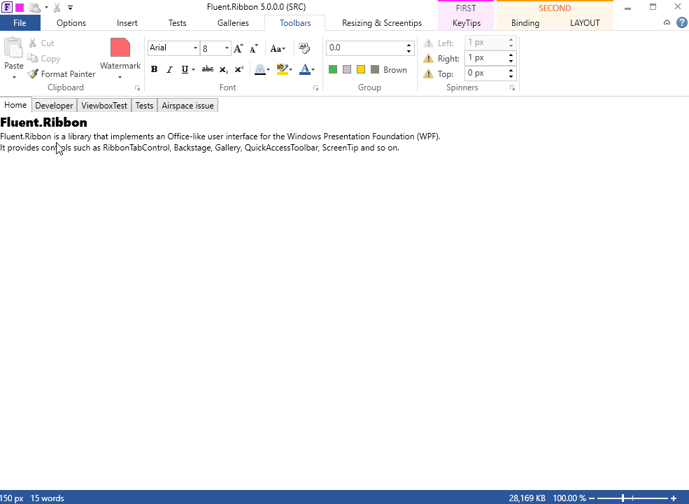

Fluent.Ribbon
=============

Fluent.Ribbon is a library that implements an Office-like user interface for the Windows Presentation Foundation (WPF). It provides controls such as RibbonTabControl, Backstage, Gallery, QuickAccessToolbar, ScreenTip and so on.

*   [More Screenshots](../../wiki/Screenshots)

# Documentation
Visit the [documentation](http://fluentribbon.github.io/documentation/).  
Almost all features are shown in the showcase application.  
The showcase application is included with every release, so you can just grab it from [releases](../../releases)  
If you think there is something missing in the showcase application feel free to create an issue for that.

To be more familiar with the Ribbon concept see [msdn article](https://docs.microsoft.com/en-us/windows/desktop/uxguide/cmd-ribbons).

## History &amp; roadmap
A history of changes is maintained in the [Changelog](Changelog.md).
The roadmap is done by [milestones](../../milestones).

If you feel lack of some important features feel free to use [issues](https://github.com/fluentribbon/Fluent.Ribbon/issues) to create an issue/feature request.

## Access to preview versions
You can access preview versions through the [AppVeyor nuget feed](https://ci.appveyor.com/nuget/fluent-ribbon).

## What you can do to help us
*   We are accepting pull requests, so you are very welcome to create one
*   [Fix some bugs](../../issues)
*   Help us translating
*   Help us updating the documentation

## Development requirements
* Visual Studio 2019 Preview 1.1 (16.0) or later (you can get the preview from https://visualstudio.microsoft.com/de/vs/preview/)
* .NET core SDK v3.0 or later (you can get the latest preview from https://dotnetcli.blob.core.windows.net/dotnet/Sdk/master/dotnet-sdk-latest-win-x64.exe)

## Designer issues
If you have issues using the designer inside of Visual Studio you can try the following things:
- Clear `%LOCALAPPDATA%\Microsoft\VisualStudio\[VERSION]\Designer\ShadowCache` or `%LOCALAPPDATA%\Microsoft\WDExpress\[VERSION]\Designer\ShadowCache` where `[VERSION]` has to be changed according to your version of Visual Studio
- Clear the `.vs` folder in your development folder

If none of that helps feel free to report an issue here.

## Formatting settings that have to be used
* For general formatting you have to use editorconfig (should work out of the box with Visual Studio 2019)
* XAML
  * Position each attribute on a separate line
    * Position first attribute on same line as start tag

## Awesome tools which Fluent.Ribbon can use

  
  
  

## Licence

[MIT License (MIT)](./License.txt)

---

This project was previously hosted on [CodePlex](https://fluent.codeplex.com/).
